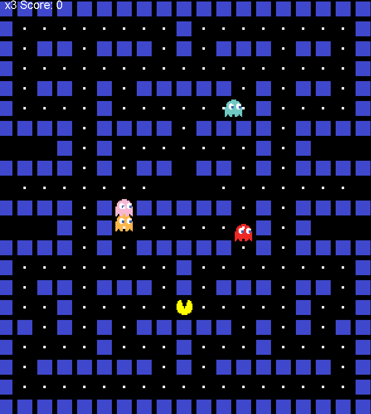

# Pac-Man

A Java recreation of the classic Pac-Man arcade game, built in IntelliJ IDEA.

## About

This is my first working draft of Pac-Man, created as a way to learn the basics of game development using Java.

I built the first version over **2 days**, spending around **1 hour each day**, while following an online tutorial and learning how the different parts of a Java game work together.

## Features

- Playable Pac-Man character
- Keyboard controls
- Maze with walls
- Wall collision detection
- Pellets to collect
- Score tracking
- Ghosts that move around the maze
- Lives system
- Game over system

## Screenshots

### Gameplay

## Built With

- **Java**
- **Java Swing**
- **Java AWT**
- **IntelliJ IDEA**

## Planned Improvements

- Smarter ghost AI
- Chase and scatter behavior
- Power pellets
- Multiple levels
- Increasing difficulty
- Sound effects
- Animations
- High score saving

## Credits

This project was created while following an online tutorial.

**Tutorial:** Code Pacman in Java  
**Link:** https://www.youtube.com/watch?v=lB_J-VNMVpE&list=PLnKe36F30Y4Y1XQOqNsL9Fgg_p6nYhcng

## Project Status

**First Draft / In Development**

This is an early version of the project. More features and improvements will be added as I continue learning Java game development.